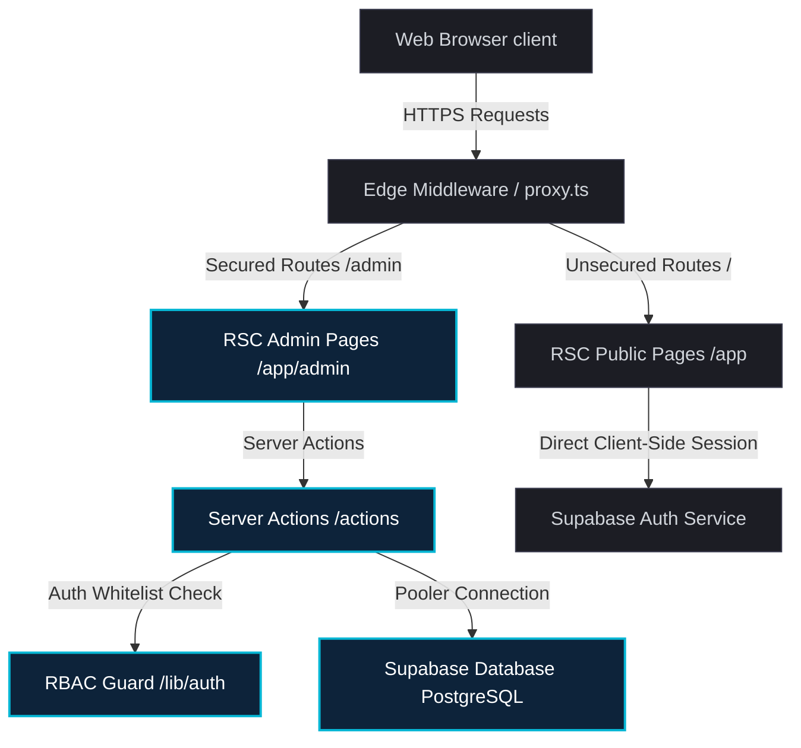

# 🏗️ Architecture Design & System Decoupling

This document describes the architectural patterns, security boundaries, and data flow of **IRNK Codes**, explaining how the Next.js 16.2.6 (App Router), React 19, and Supabase stack interact.

---

## 1. System Topology Overview

---

## 2. Key Architectural Tenets

### 1. Server-First Architecture (RSC by Default)
- **React Server Components (RSC)**: All pages in the `/app` router are Server Components by default. Data fetching is performed directly on the server to minimize client-side JavaScript bundle sizes and prevent execution waterfalls.
- **Partial Prerendering (PPR)**: Dynamic segments (like `/admin/analytics` or `/services`) utilize partial prerendering where static layout frames are served instantly, while dynamic segments stream live content concurrently via `<Suspense>` boundaries.

### 2. Strict Client-Server Boundaries
- Client interactions are isolated into micro-islands using the `"use client"` directive.
- Heavy libraries, direct database drivers, and raw HTML sanitizers are strictly prohibited on the client side and are contained inside `/actions` or server-only helpers.
- Asset rendering (such as TipTap HTML content) utilizes secure parsing and HTML element sanitization on the server before hydration.

### 3. SecOps & Row-Level Security (RLS)
- **Supabase PostgreSQL RLS**: Every table in the database is locked down with strict RLS policies. Public roles possess read-only (SELECT) access for content schemas (articles, services, projects).
- **Mutations Authorization**: Administrative functions (INSERT, UPDATE, DELETE) are restricted solely to users whitelisted in the `ADMIN_EMAILS` array.
- **RPC Validation**: Sensitive database increments (like article page-views) are processed using secure PL/pgSQL database functions (RPCs) which execute rate-limit handshakes and prevent manual inflation.

### 4. Edge Routing & Next.js 16 Proxy
- The middleware layer is implemented in [`proxy.ts`](proxy.ts) (replaces `middleware.ts` in Next.js 16).
- **Functionality**:
  - Handles path rewrites and session state parsing.
  - Mitigates bot scraping activity and rate-limits API endpoints.
  - Appends secure headers (e.g., Content-Security-Policy, Strict-Transport-Security) to browser responses.

---

## 3. Core Directory Layout

- `/app`: Direct routing handlers, dynamic layouts, static metadata packages, and Opengraph generators.
- `/actions`: Mutative backend actions, validation-first schemas (Zod), and auth-check boundaries.
- `/lib/auth`: WHitelist validation helper (`requireAdmin`) and role management.
- `/lib/security`: Secure text sanitizers and input check utilities.
- `/supabase/migrations`: Fully structured SQL schema, indexes, and custom PL/pgSQL function controllers.
