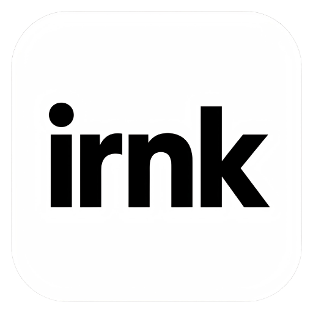
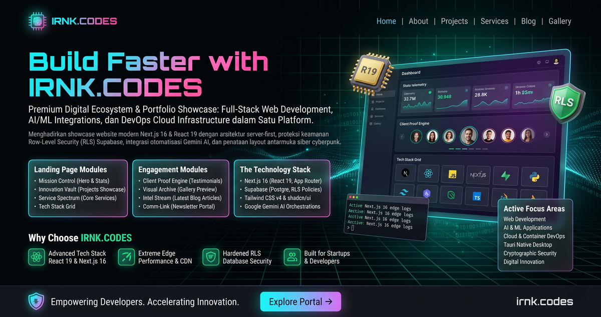

# 
⚡ IRNK CODES — Premium Cyberpunk Digital Ecosystem

  

  <strong>An immersive, high-performance, and secure-by-default developer portfolio, tech center, and automation engine.</strong>

  
  
  
  
  

  

---

## 🔮 What is IRNK CODES?

**IRNK CODES** is a premium, cutting-edge digital ecosystem that functions as a sophisticated technical portfolio, developer blog, and operations center. Designed with a custom retro-futuristic **cyberpunk hacker-HUD layout**, the application combines deep HSL variables, fluid glassmorphic container aesthetics, glowing neon borders, and micro-interactive framer-motion transitions.

The engine represents a production-grade showcase of modern web engineering, prioritizing **server-first architectures**, secure whitelisted server actions, and aggressive client bundle optimization.

---

## 🎨 Landing Page Architecture & Core Sections

The landing page of **IRNK CODES** is structured into modular sections designed to showcase technical capabilities and engage audience telemetry:

### 1. 🖥️ Mission Control (Hero & Stats)
An immersive, high-impact introductory segment displaying the platform tagline and core mission, supported by a live stats console tracking years of experience, projects delivered, happy clients, and mastered technologies.

### 2. 🗃️ Innovation Vault (Featured Projects)
A database-driven showcase of engineered systems and applications, enabling visitors to explore technical descriptions, live applications, and separate code repositories.

### 3. ⚙️ Service Spectrum (Core Services)
An interactive presentation of consulting and development services, highlighting expertise in Full-Stack Web Development, AI/ML integrations, and DevOps orchestrations.

### 4. 🛠️ Tech Stack Grid
A visual database representing the frameworks, database backends, styling systems, and cloud infrastructure platforms mastered in the ecosystem.

### 5. 👥 Client Proof Engine (Testimonials)
A fluid recommendations carousel showcasing verified reviews and feedback from clients, creators, and engineering partners.

### 6. 🖼️ Visual Archive (Gallery Preview)
 A visual masonry-grid showcase rendering development setups, design mockups, event images, and high-fidelity tech art.

### 7. 📰 Intel Stream (Latest Blog Articles)
An editorial sector exhibiting the newest guides, tech reviews, and engineering articles written to share deep knowledge with the developer community.

### 8. 📨 Comm-Link (Newsletter Portal)
A secure subscription component allowing visitors to join the email list for direct announcements, tech articles, and system updates.

---

## 👨‍💻 Meet the Founder

<table align="center">
  <tr>
    <td align="center" width="220" style="border: 1px solid rgba(6, 182, 212, 0.25); background: rgba(2, 4, 6, 0.6);">
      
       
      <strong>Eliyanto Sarage</strong>
       
      Founder & Lead Engineer
    </td>
    <td valign="top" style="padding-left: 20px; border: 1px solid rgba(6, 182, 212, 0.25); background: rgba(2, 4, 6, 0.3);">
      <h3>🚀 Senior Full-Stack Developer, UI/UX Designer & AI Engineer</h3>
      

        I do not just build software; I engineer the future. I combine strict cryptographic security, robust cloud scalability, and modern AI orchestration with premium, visually breathtaking frontends to create memorable digital experiences.
      

      <h4>Core Expertises:</h4>
      <ul>
        <li><strong>Frontend</strong>: Next.js (App Router, RSC), React 19, TypeScript, Tailwind CSS v4, Framer Motion.</li>
        <li><strong>Backend & Security</strong>: Supabase, PostgreSQL (RLS), Node.js, RESTful & RPC APIs, Secure RBAC.</li>
      </ul>
      <h4>Get in Touch:</h4>
      

        
        
        
        
      

    </td>
  </tr>
</table>

---

  Developed with ⚡ by <strong><a href="https://irnk.codes">Eliyanto Sarage</a></strong> · Wonosobo, Central Java, Indonesia.

