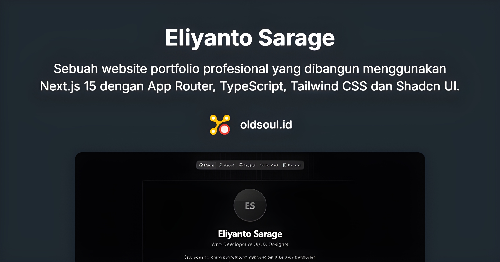

# Personal Portfolio Website

[](https://nextjs.org)
[](https://reactjs.org)
[](https://www.typescriptlang.org)
[](https://tailwindcss.com)
[](https://eslint.org)
[](LICENSE)
[](https://idugeni.github.io)

Sebuah website portfolio profesional yang dibangun menggunakan Next.js 15 dengan App Router, TypeScript, dan Tailwind CSS. Website ini menampilkan pengalaman profesional, proyek-proyek, dan informasi kontak dalam antarmuka yang modern dan responsif.



## 📑 Daftar Isi
- [🚀 Fitur](#-fitur)
- [🛠️ Teknologi](#️-teknologi)
- [🏃‍♂️ Cara Menjalankan Lokal](#️-cara-menjalankan-lokal)
- [📁 Struktur Proyek](#-struktur-proyek)
- [🌐 Arsitektur](#-arsitektur)
- [🚀 Deployment](#-deployment)
- [📝 License](#-license)
- [👥 Kontribusi](#-kontribusi)
- [📝 Credits](#-credits)
- [📋 Changelog](#-changelog)
- [🔒 Security](#-security)
- [💬 Support](#-support)
- [🌟 Star History](#-star-history)

## 🚀 Fitur

- **Modern Tech Stack**: Dibangun dengan Next.js 13, TypeScript, dan Tailwind CSS
- **Responsif**: Tampilan yang optimal di semua ukuran layar (mobile, tablet, desktop)
- **Performa Tinggi**: Optimasi SEO, loading yang cepat, dan skor Lighthouse yang tinggi
- **Konten Dinamis**: Data dikelola melalui JSON files untuk kemudahan pembaruan
- **Animasi Halus**: Menggunakan viewport-based animations untuk UX yang menarik
- **Dark Mode**: Dukungan tema gelap untuk kenyamanan pengguna
- **Aksesibilitas**: Mengikuti standar WCAG untuk aksesibilitas yang baik
- **Type Safety**: Implementasi TypeScript untuk kode yang lebih aman dan maintainable

## 🛠️ Teknologi

### Frontend
- [Next.js 15.2.4](https://nextjs.org) - React framework dengan App Router
- [React 19.1.0](https://reactjs.org) - JavaScript library untuk UI
- [TypeScript 5](https://www.typescriptlang.org) - JavaScript dengan type safety
- [Tailwind CSS 4](https://tailwindcss.com) - Utility-first CSS framework
- [Radix UI](https://www.radix-ui.com/) - Headless component library

### Development Tools
- [ESLint](https://eslint.org) - Linting untuk JavaScript/TypeScript
- [Prettier](https://prettier.io) - Code formatter
- [Husky](https://typicode.github.io/husky) - Git hooks
- [Commitlint](https://commitlint.js.org) - Conventional commits

## 🏃‍♂️ Cara Menjalankan Lokal

1. Clone repository:
```bash
git clone https://github.com/idugeni/idugeni.github.io.git
cd idugeni.github.io
```

2. Install dependencies:
```bash
npm install
```

3. Jalankan development server:
```bash
npm run dev
```

4. Buka [http://localhost:3000](http://localhost:3000) di browser

## 📁 Struktur Proyek

```
├── src/
│   ├── app/          # Next.js App Router pages
│   │   ├── about/    # Halaman About
│   │   ├── projects/ # Halaman Projects
│   │   ├── resume/   # Halaman Resume
│   │   └── contact/  # Halaman Contact
│   ├── components/   # React components
│   │   ├── layout/   # Layout components
│   │   ├── sections/ # Section components
│   │   └── ui/       # UI components
│   ├── data/        # JSON data files
│   ├── hooks/       # Custom React hooks
│   ├── lib/         # Utility functions
│   └── types/       # TypeScript types
├── public/          # Static assets
└── package.json     # Project dependencies
```

## 🌐 Arsitektur


## 🚀 Deployment

Proyek ini di-deploy menggunakan [Vercel](https://vercel.com). Setiap push ke branch `main` akan otomatis men-trigger deployment baru.

### Continuous Integration/Deployment
- **Build**: Otomatis build dan test pada setiap push
- **Preview**: Deploy preview untuk setiap pull request
- **Production**: Auto-deploy ke production untuk merge ke main

## 📝 License

Proyek ini dilisensikan di bawah [MIT License](LICENSE).

## 👥 Kontribusi

Kontribusi selalu diterima! Silakan buat issue atau pull request untuk perbaikan atau peningkatan. Sebelum berkontribusi, mohon baca [Kode Etik](CODE_OF_CONDUCT.md) kami.

### Cara Berkontribusi
1. Fork repository
2. Buat branch fitur (`git checkout -b feature/AmazingFeature`)
3. Commit perubahan (`git commit -m 'Add some AmazingFeature'`)
4. Push ke branch (`git push origin feature/AmazingFeature`)
5. Buat Pull Request menggunakan [template yang disediakan](.github/PULL_REQUEST_TEMPLATE.md)

### Melaporkan Masalah
- Gunakan [template bug report](.github/ISSUE_TEMPLATE/bug_report.md) untuk melaporkan bug
- Gunakan [template feature request](.github/ISSUE_TEMPLATE/feature_request.md) untuk mengusulkan fitur baru

### Dukungan
Jika Anda ingin mendukung pengembangan proyek ini, Anda dapat memberikan donasi melalui platform yang tersedia di [halaman sponsor](.github/FUNDING.yml).

### Panduan Kontribusi
- Ikuti code style yang ada menggunakan ESLint dan Prettier
- Update dokumentasi jika diperlukan
- Tambahkan unit test untuk fitur baru
- Pastikan semua test passed sebelum submit PR

### Standar Commit Message
Kami menggunakan [Conventional Commits](https://www.conventionalcommits.org/) untuk format commit message:

```
<type>[optional scope]: <description>

[optional body]
[optional footer]
```

Tipe yang tersedia:
- `feat`: Fitur baru
- `fix`: Perbaikan bug
- `docs`: Perubahan dokumentasi
- `style`: Perubahan formatting
- `refactor`: Refactoring kode
- `test`: Menambah/update test
- `chore`: Maintenance

### Proses Code Review
1. Pastikan deskripsi PR jelas dan lengkap
2. Tunggu review dari minimal satu maintainer
3. Address semua feedback yang diberikan
4. Setelah disetujui, maintainer akan merge PR

## 📝 Credits
Dibuat dan dikelola oleh [Idugeni](https://github.com/idugeni)

Kontributor:
- [Daftar kontributor](https://github.com/idugeni/idugeni.github.io/graphs/contributors)

## 📋 Changelog
Lihat [CHANGELOG.md](CHANGELOG.md) untuk daftar perubahan.

## 🔒 Security
Jika Anda menemukan masalah keamanan, mohon jangan buat issue publik.
Silakan kirim email ke security@oldsoul.id

## 💬 Support
- GitHub Issues: Untuk bug report dan feature request
- Email: support@oldsoul.id
- Discord: [Join Server](https://discord.gg/eliyantosarage)

## 🌟 Star History

[](https://star-history.com/#idugeni/idugeni.github.io&Date)
